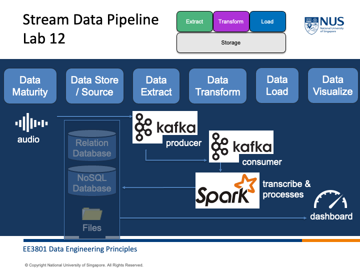

# Lab 12 Stream Data Pipeline IV - Kafka & Spark (Optional)

Many companies mix and match different softwares to tap on each software's strength. This week you will integrate Apache Kafka, Apache Spark, Elasticsearch and Kibana.

This lab is optional. You do not need to submit anything. 

Create a new jupyter notebook file "stream_data_pipeline_4_kafka_spark.ipynb".


```python
import os
home_directory = os.path.expanduser("~")
os.chdir(home_directory+'/Documents/projects/ee3801')
```

Many video content in online streaming platforms do not have audio captions and who-say-what features. The technology company would like you to create an end-to-end real-time system that captures the audio, transcibes it, identify different speakers in text and insert the information into the NoSQL database for real-time analysis. 

Using the diagram below and the lab notes from previous weeks, implement the system. The system should:
1. Capture audio from your device
2. Pass the audio through Apache Kafka
3. Transcribe, identify speakers in text and insert the data in elasticsearch using Apache Spark 
4. In real-time visualise the video content with transcription in caption and differentiate speakers.




# Conclusion

- You have successfully integrated all that you have learnt in this course using Apache Kafka, Apache Spark, Elasticsearch and Kibana. 
- You are not expected to submit anything but I welcome you to share your implementation and we can discuss the excitement of your achievements.


