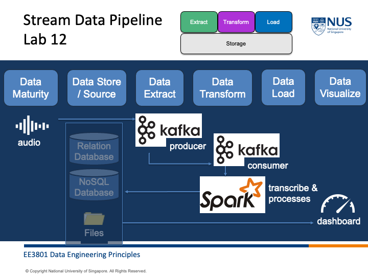

# Lab 12 Stream Data Pipeline IV - Kafka & Spark (Optional)

Many companies mix and match different softwares to tap on each software's strength. In this optional lab, you will integrate Apache Kafka, Apache Spark, Elasticsearch, and Kibana to build an end-to-end streaming pipeline.

This lab is optional. You do not need to submit anything. 

Create a new Jupyter notebook file named `stream_data_pipeline_4_kafka_spark.ipynb`.


```python
import os
home_directory = os.path.expanduser("~")
os.chdir(os.path.join(home_directory, 'Documents', 'projects', 'ee3801'))
```

Many online video platforms do not provide captions or speaker attribution for audio content. In this lab, you will design a real-time system that:

1. Captures audio from your device.
2. Sends audio data through Apache Kafka.
3. Uses Apache Spark to transcribe audio, identify speakers, and insert the results into Elasticsearch.
4. Visualizes the transcription and speaker information in real time using Kibana.

Use the diagram below and the lab notes from previous weeks to guide your implementation.



# Conclusion

- You have combined the technologies learned in this course: Apache Kafka, Apache Spark, Elasticsearch, and Kibana.
- This lab is optional, so no submission is required.
- Feel free to share your implementation if you want feedback or discussion on your design and results.


